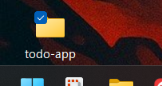

# 概要

- 初心者向けにシンプルなToDoアプリの作り方を紹介した
  - HTML, CSS, JS(JavaScript) のみを使ったシンプルなWebアプリ
  - 最短30〜60分で、動くToDoアプリを完成できる
- 必須パート（ここまでで完成）と発展パート（時間や実力に応じてチャレンジ）に分けた

## 背景

- [はじめてのハッカソン by Voltech](https://nxtend.connpass.com/event/374903/) においてハッカソン初心者である参加者に、よりハッカソンを楽しんでもらうため

## 対象読者

- [はじめてのハッカソン by Voltech](https://nxtend.connpass.com/event/374903/) 参加者
- 初めてハッカソンに参加する人
- ハッカソンに参加してみたい気持ちがあるが、何をどのように作れば良いかわからない人

## 出来上がるもの

- Webアプリとしての、シンプルなToDoアプリ

## 環境

- PC
- ブラウザ（Chrome、Edge など）
- テキストエディタ（メモ帳、VS Code など）

---

# 開発環境の準備

## ゴール

- ブラウザで自分のHTMLファイルを開ける状態にする

## 手順

1. デスクトップなど好きな場所に todo-app フォルダを作る
2. その中に `index.html`, `style.css`, `main.js` の3つを作る
   - `Windows であれば、右クリック → 新規作成 → テキストドキュメント` などです！
   - ファイル名を `新規 テキスト ドキュメント.txt` から `index.html` に変えればOK！
3. index.html をブラウザで開く（おそらくダブルクリックでOK）
4. ブラウザで真っ白なページができる

:::details Windows の場合の画像例


:::

# HTMLで土台を作る

## ゴール

- 画面に「タイトル・入力欄・追加ボタン・空のリスト」が見える

## サンプルコード

```html
<!DOCTYPE html>
<html lang="ja">
  <head>
    <meta charset="UTF-8" />
    <title>はじめてのToDoリスト</title>
    <link rel="stylesheet" href="style.css" />
  </head>
  <body>
    <h1>はじめてのToDoリスト</h1>

    <div class="input-area">
      <input id="todo-input" type="text" placeholder="やることを入力" />
      <button id="add-button">追加</button>
    </div>

    <ul id="todo-list"></ul>

    <script src="main.js"></script>
  </body>
</html>
```

## 簡単な説明

- `<h1>`: タイトル
- `<input>`: 入力欄。id="todo-input" が後でJSから使う「名前」
- `<button>`: ボタン
- `<ul>`: 箇条書きリスト。ここにToDoが増えていく
- `<script src="main.js">`: 最後に書く。JSファイルを読みこむ

# CSSでちょっとキレイにする

## ゴール

少しマシな見た目に整える

## サンプルコード

```CSS
/* style.css */
body {
  font-family: system-ui, -apple-system, BlinkMacSystemFont, "Segoe UI",
    sans-serif;
  max-width: 480px;
  margin: 40px auto;
  padding: 0 16px;
  line-height: 1.5;
}

h1 {
  text-align: center;
}

.input-area {
  display: flex;
  gap: 8px;
}

#todo-input {
  flex: 1;
  padding: 8px;
}

#add-button {
  padding: 8px 12px;
  cursor: pointer;
}

#todo-list {
  margin-top: 16px;
  padding-left: 0;
  list-style: none;
}

#todo-list li {
  padding: 4px 0;
  border-bottom: 1px solid #ddd;
}
```

# JavaScriptで「追加ボタン」を動かす

```js
const input = document.getElementById("todo-input");
const button = document.getElementById("add-button");
const list = document.getElementById("todo-list");

function addTodo() {
  const text = input.value.trim(); // 入力された文字

  if (text === "") {
    // 何も書いてなかったら何もしない
    return;
  }

  const li = document.createElement("li"); // <li>を作る
  li.textContent = text; // 中身の文字をセット
  list.appendChild(li); // <ul>の一番下に追加

  input.value = ""; // 入力欄を空にする
  input.focus(); // 入力欄にカーソルを戻す
}

button.addEventListener("click", addTodo);
```

# トラブルシューティング

- ボタンを押しても何も起こらない
  - `main.js` のファイル名を確認してみる
  - `<script src="main.js"></script>` が `<body>` のいちばん下にあるか確認してみる
- ブラウザを更新していない
  - 保存したら必ずブラウザで更新ボタンを押す（または F5 キー）
- 日本語が文字化けする
  - `<meta charset="UTF-8">` が入っているか確認する

---

# 参考文献
